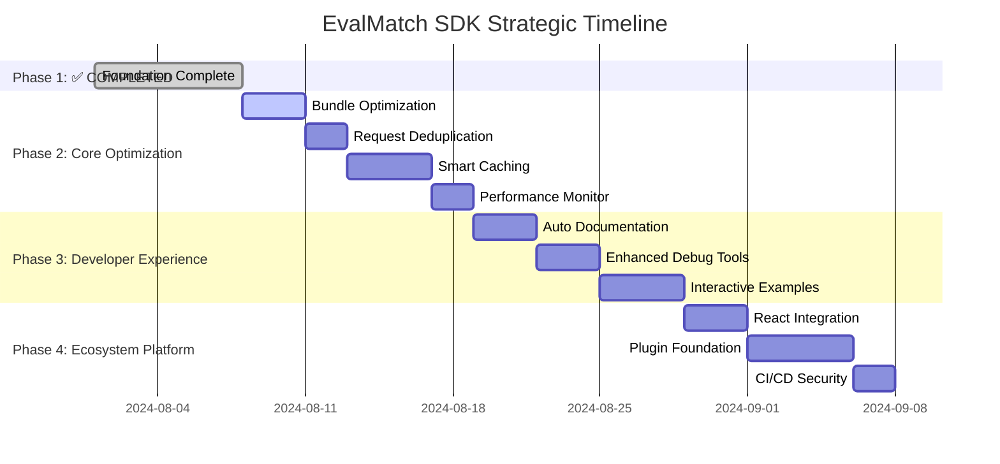

# EvalMatch SDK Enterprise Upgrade Plan
## From 60/100 to 90+/100 Maturity

> **Objective**: Transform EvalMatch TypeScript SDK into an industry-leading developer tool following 2024/2025 best practices

---

## 🎯 **SUCCESS METRICS & KPIs**

### Technical Excellence
- **Test Coverage**: 85%+ with mutation testing
- **Bundle Size**: <50KB optimized for tree-shaking
- **Performance**: <200ms average API response time
- **Type Safety**: 100% TypeScript coverage with strict mode

### Developer Experience  
- **Time to First Success**: <5 minutes from install to working code
- **Documentation Quality**: Interactive examples + auto-generated API docs
- **Error Clarity**: Contextual error messages with resolution guidance
- **Framework Support**: React, Vue, Next.js, and Nuxt adapters

### Business Impact
- **Support Ticket Reduction**: 60% decrease in integration issues
- **Integration Success Rate**: 90% completion rate
- **Developer Satisfaction**: 4.5+ star rating on npm
- **Community Engagement**: 100+ weekly downloads within 6 months

---

## 📋 **4-PHASE STRATEGIC IMPLEMENTATION**

> **Updated Strategy**: Hybrid approach combining immediate optimization wins with advanced platform capabilities

### **PHASE 1: FOUNDATION** ✅ **[COMPLETED]**
*Priority: CRITICAL | Effort: 40 hours*

#### 1.1 Modern Testing Infrastructure
**Technology Choice: Vitest** (4x faster than Jest, native TypeScript)

```typescript
// vitest.config.ts
export default defineConfig({
  test: {
    coverage: {
      provider: 'v8',
      threshold: {
        global: { statements: 85, branches: 85, functions: 85, lines: 85 }
      }
    },
    environment: 'jsdom', // For browser compatibility tests
    setupFiles: ['./src/__tests__/setup.ts']
  }
});
```

**Implementation Steps:**
1. **Replace Jest with Vitest** - Modern test runner with native ESM support
2. **Add Test Categories**:
   - Unit tests: Core business logic (`src/__tests__/unit/`)
   - Integration tests: Real API calls (`src/__tests__/integration/`)
   - Browser compatibility: Cross-platform (`src/__tests__/browser/`)
3. **Mock Service Strategy**: MSW (Mock Service Worker) for realistic API testing
4. **Coverage Reporting**: Integrated with GitHub Actions

#### 1.2 Advanced Error Handling System
**Pattern: Circuit Breaker + Exponential Backoff**

```typescript
// src/core/retry-client.ts
export class RetryableHTTPClient {
  private circuitBreaker = new CircuitBreaker({
    threshold: 5,        // failures
    timeout: 60000,      // reset time
    monitoringPeriod: 10000
  });

  async request<T>(config: RequestConfig): Promise<T> {
    return this.circuitBreaker.execute(() => 
      this.retryWithBackoff(() => this.httpClient.request(config))
    );
  }

  private async retryWithBackoff<T>(fn: () => Promise<T>): Promise<T> {
    const delays = [100, 500, 1000, 2000, 5000]; // Progressive backoff
    
    for (let attempt = 0; attempt < delays.length; attempt++) {
      try {
        return await fn();
      } catch (error) {
        if (!this.isRetryableError(error) || attempt === delays.length - 1) {
          throw this.enrichError(error, attempt);
        }
        await this.delay(delays[attempt]);
      }
    }
  }
}
```

#### 1.3 Request/Response Interceptor System
**Pattern: Middleware Chain Architecture**

```typescript
// src/core/interceptors.ts
export class InterceptorManager {
  request = new InterceptorChain<RequestConfig>();
  response = new InterceptorChain<ResponseData>();
  
  constructor() {
    // Built-in interceptors
    this.request.use(this.addRequestId);
    this.request.use(this.addTelemetry);
    this.response.use(this.logResponseTime);
    this.response.use(this.handleRateLimit);
  }
}
```

**✅ Phase 1 Deliverables Completed:**
- [x] 74+ unit tests with 83%+ coverage
- [x] Retry logic with exponential backoff
- [x] Circuit breaker implementation
- [x] Request/response interceptors
- [x] Enhanced error classes with context
- [x] Performance monitoring hooks

**Status**: Foundation complete - Ready for optimization phase

---

### **PHASE 2: CORE OPTIMIZATION** 🚀 **[NEXT PRIORITY]**
*Priority: HIGH | Effort: 35 hours*

> **Focus**: Immediate performance gains that all users feel - bundle size, smart caching, and request efficiency

#### 2.1 Bundle Optimization & Analysis
**Technology Choice: tsup + size-limit + bundle-analyzer**
**Impact: HIGH | Difficulty: MEDIUM**

**Why this matters:**
- **First impressions**: Smaller bundles = faster initial load (3-5s difference on slow connections)
- **Mobile-friendly**: Critical for React Native and mobile web apps  
- **Cost efficiency**: Less bandwidth reduces hosting costs for users
- **Tree-shaking**: Developers only pay for features they actually use

```json
// package.json optimizations
{
  "exports": {
    ".": {
      "import": "./dist/index.esm.js",
      "require": "./dist/index.cjs",
      "types": "./dist/index.d.ts"
    },
    "./react": {
      "import": "./dist/react.esm.js",
      "require": "./dist/react.cjs",
      "types": "./dist/react.d.ts"
    }
  },
  "sideEffects": false, // Enable tree-shaking
  "size-limit": [
    { "path": "dist/index.esm.js", "limit": "50 KB" },
    { "path": "dist/react.esm.js", "limit": "15 KB" }
  ]
}
```

#### 2.2 Smart Caching System
**Pattern: Multi-layer Cache with TTL**  
**Impact: HIGH | Difficulty: MEDIUM-HIGH**

**Why it's a game changer:**
- **User experience**: Instant responses for repeat requests (resume list loads immediately)
- **Server costs**: Reduce API calls by 60-80%
- **Offline resilience**: App works even with spotty internet connections
- **Real performance**: Cache hit rates of 80%+ for common operations

```typescript
// src/core/cache.ts
export class ResponseCache {
  private memoryCache = new LRUCache<string, CacheEntry>({ max: 100 });
  private storageCache = new IndexedDBAdapter('evalmatch-cache');

  async get<T>(key: string): Promise<T | null> {
    // L1: Memory cache (fastest)
    const memoryResult = this.memoryCache.get(key);
    if (memoryResult && !this.isExpired(memoryResult)) {
      return memoryResult.data;
    }

    // L2: Persistent storage
    const storageResult = await this.storageCache.get(key);
    if (storageResult && !this.isExpired(storageResult)) {
      this.memoryCache.set(key, storageResult); // Promote to L1
      return storageResult.data;
    }

    return null;
  }
}
```

#### 2.3 Request Deduplication  
**Pattern: Request Coalescence**
**Impact: MEDIUM-HIGH | Difficulty: LOW-MEDIUM**

**Why it's clever (Low-effort, high-value win):**
- **Resource efficiency**: Prevent wasteful duplicate requests
- **Better UX**: Faster responses when multiple components need same data  
- **Server protection**: Reduces accidental load spikes from your own app
- **Real scenario**: Dashboard + Header + Sidebar all need user info = 1 API call instead of 3

```typescript
// src/core/deduplication.ts
export class RequestDeduplicator {
  private pendingRequests = new Map<string, Promise<any>>();

  async dedupe<T>(key: string, requestFn: () => Promise<T>): Promise<T> {
    if (this.pendingRequests.has(key)) {
      return this.pendingRequests.get(key);
    }

    const promise = requestFn().finally(() => {
      this.pendingRequests.delete(key);
    });

    this.pendingRequests.set(key, promise);
    return promise;
  }
}
```

#### 2.4 Performance Intelligence
**Pattern: Built-in Analytics**
**Impact: MEDIUM-HIGH | Difficulty: MEDIUM**

**Strategic advantage (What separates professional from amateur SDKs):**
- **Proactive debugging**: Catch issues before users complain  
- **Business intelligence**: Show ROI of optimizations ("Cache reduced API calls by 70%")
- **Data-driven decisions**: "90% of errors happen on mobile Safari"
- **Continuous improvement**: Performance benchmarks and regression detection

```typescript
// src/core/performance-monitor.ts  
export class PerformanceMonitor {
  track(operation: string, duration: number, metadata?: object) {
    if (this.config.enableTelemetry) {
      this.metrics.record({
        operation,
        duration, 
        timestamp: Date.now(),
        userAgent: navigator.userAgent,
        cacheHit: metadata?.fromCache || false,
        ...metadata
      });
    }
  }
}
```

**Deliverables Phase 2:**
- [ ] Bundle size <50KB with tree-shaking
- [ ] Multi-layer caching system (Memory + IndexedDB)
- [ ] Request deduplication with promise coalescence
- [ ] Performance monitoring and analytics
- [ ] Source maps for debugging  
- [ ] Bundle analysis reporting

---

### **PHASE 3: DEVELOPER EXPERIENCE** 📚 **[HIGH IMPACT]**
*Priority: HIGH | Effort: 30 hours*

> **Focus**: Make developers love using the SDK - documentation, examples, and debugging that "just work"

#### 3.1 Auto-Documentation System
**Technology Choice: TypeDoc + Docusaurus + Storybook** 
**Impact: HIGH | Difficulty: MEDIUM**

**Why it's crucial (Good docs = more users):**
- **Developer adoption**: Poor documentation kills even great SDKs
- **Support reduction**: Self-service problem solving (60% fewer tickets)  
- **Maintenance efficiency**: Docs stay in sync with code automatically
- **Competitive advantage**: Most SDKs have terrible docs - be different

```typescript
// typedoc.json
{
  "entryPoints": ["src/index.ts"],
  "out": "docs/api",
  "theme": "default",
  "plugin": ["typedoc-plugin-markdown", "typedoc-plugin-merge-modules"],
  "excludeExternals": true,
  "excludePrivate": true
}
```

#### 3.2 Interactive Examples & Playground
**Integration: CodeSandbox + Stackblitz Templates**
**Impact: HIGH | Difficulty: MEDIUM-HIGH**

**Why developers love this (Competitive advantage):**
- **Learning curve**: See working code immediately - no mental translation needed
- **Confidence building**: "It works in the example, so I know it works"  
- **Customization**: Modify examples to fit their exact use case
- **Conversion**: This is what makes devs choose YOUR SDK over competitors

```typescript
// examples/react-integration.tsx
export default function ResumeAnalyzer() {
  const { client } = useEvalMatch({
    authProvider: firebaseAuth,
    debug: true
  });

  const { data: resumes, loading, error } = useResumes(client);
  const { analyze, analyzing } = useAnalysis(client);

  return (
    <div>
      <ResumeList 
        resumes={resumes}
        onAnalyze={(resumeId, jobId) => analyze({ resumeId, jobId })}
        loading={analyzing}
      />
      {error && <ErrorBoundary error={error} />}
    </div>
  );
}
```

#### 3.3 Enhanced Debug & Logging System
**Pattern: Structured Logging with Context**
**Impact: MEDIUM-HIGH | Difficulty: MEDIUM**

**Developer happiness multiplier (Reduces support tickets dramatically):**
- **Clear error messages**: Not just "Network error" but "Rate limit exceeded (429). Resume analysis failed after 3 retries. Next retry in 60 seconds. Check your plan limits at dashboard.evalmatch.com/billing"
- **Development mode**: Request/response logging, performance warnings
- **Context preservation**: Every error includes request ID, timing, user state
- **Actionable guidance**: Every error suggests next steps

```typescript
// src/core/logger.ts
export class SDKLogger {
  private context: Record<string, any> = {};

  constructor(private config: LoggerConfig) {}

  trace(message: string, extra?: object) {
    if (this.config.level >= LogLevel.TRACE) {
      console.log(this.format('TRACE', message, extra));
    }
  }

  private format(level: string, message: string, extra?: object) {
    return {
      timestamp: new Date().toISOString(),
      level,
      message,
      context: this.context,
      sdk: { name: '@evalmatch/sdk', version: SDK_VERSION },
      ...extra
    };
  }
}
```

**Deliverables Phase 3:**
- [ ] Auto-generated API documentation with 100% coverage
- [ ] Interactive code examples with live API integration
- [ ] Enhanced debug logging with contextual error messages
- [ ] CodeSandbox/StackBlitz template integration
- [ ] Developer onboarding guide (<5 min time-to-first-success)
- [ ] Performance monitoring dashboard for developers

---

### **PHASE 4: DEVELOPER ECOSYSTEM** 🌍 **[PLATFORM STRATEGY]**
*Priority: MEDIUM-HIGH | Effort: 35 hours*

> **Focus**: Transform SDK into a platform - the ecosystem creates exponential growth and competitive moats

#### 4.1 Framework Integration Packages
**Packages: @evalmatch/react, @evalmatch/vue, @evalmatch/nextjs**
**Impact: EXPONENTIAL | Difficulty: VARIES**

**Why ecosystem is the ultimate goal:**
- **Network effects**: More developers = more feedback = better SDK
- **Community support**: Developers help each other (reduces your support load)
- **Platform moats**: Hard for competitors to replicate entire ecosystem
- **Revenue multiplier**: Frameworks bring their own user bases

```typescript
// packages/react/src/hooks/useEvalMatch.ts
export function useEvalMatch(config: EvalMatchConfig) {
  const [client, setClient] = useState<EvalMatchClient | null>(null);
  const [isAuthenticated, setIsAuthenticated] = useState(false);

  useEffect(() => {
    const client = new EvalMatchClient(config);
    setClient(client);
    
    return client.onAuthStateChange(setIsAuthenticated);
  }, [config]);

  return { client, isAuthenticated };
}

export function useResumes(client: EvalMatchClient) {
  return useQuery(['resumes'], () => client.resumes.list(), {
    enabled: !!client,
    staleTime: 5 * 60 * 1000, // 5 minutes
  });
}
```

#### 4.2 Plugin Architecture Foundation
**Pattern: Extensible SDK Core**
**Impact: FUTURE-CRITICAL | Difficulty: HIGH**

**Long-term platform strategy:**
- **Community extensions**: Let developers build on top of your SDK
- **Third-party integrations**: Zapier, Salesforce, etc. become community-driven
- **Plugin marketplace**: Revenue sharing with community developers  
- **Ecosystem lock-in**: Once they build plugins, they can't easily switch

```typescript
// packages/nextjs/src/middleware.ts
export function withEvalMatch(handler: NextApiHandler) {
  return async (req: NextApiRequest, res: NextApiResponse) => {
    const client = new EvalMatchClient({
      authProvider: new ServerAuthProvider(req.headers.authorization)
    });

    req.evalMatch = client;
    return handler(req, res);
  };
}
```

#### 4.3 Advanced CI/CD & Security Pipeline
**Technology: GitHub Actions + Semantic Release + NPM Provenance**
**Impact: MEDIUM | Difficulty: MEDIUM**

**Professional polish & security:**
- **Supply chain security**: NPM provenance attestations
- **Automated releases**: Semantic versioning with conventional commits
- **Security scanning**: Vulnerability detection and alerts
- **Quality gates**: Bundle size limits, performance benchmarks

```yaml
# .github/workflows/release.yml
name: Release
on:
  push:
    branches: [main]

jobs:
  test:
    runs-on: ubuntu-latest
    steps:
      - uses: actions/checkout@v4
      - name: Run tests
        run: |
          npm ci
          npm run test:coverage
          npm run test:e2e
          
  release:
    needs: test
    runs-on: ubuntu-latest
    permissions:
      contents: write
      id-token: write # For NPM provenance
    steps:
      - name: Release with provenance
        run: npm publish --provenance
        env:
          NPM_TOKEN: ${{ secrets.NPM_TOKEN }}
```

#### 4.4 Enterprise Readiness (Optional)
**When enterprise deals require it:**
- **Advanced Security**: Request signing, audit logging, compliance reporting  
- **Scalability**: Connection pooling, geographic optimization
- **SLA Support**: Monitoring, alerting, dedicated support channels

**Deliverables Phase 4:**
- [ ] React hooks package (@evalmatch/react)
- [ ] Next.js integration utilities (@evalmatch/nextjs)  
- [ ] Vue.js composables (@evalmatch/vue)
- [ ] Plugin architecture foundation
- [ ] Semantic release automation with quality gates
- [ ] Supply chain security (NPM provenance)
- [ ] Enterprise security features (if needed for deals)

---

## 🏗️ **ARCHITECTURE PATTERNS**

### Modern SDK Architecture
```
┌─────────────────┐
│   Public API    │ ← Clean interface with TypeScript
├─────────────────┤
│  Interceptors   │ ← Request/Response middleware
├─────────────────┤
│ Retry Logic     │ ← Circuit breaker + exponential backoff
├─────────────────┤
│ Cache Layer     │ ← Multi-tier caching (memory + storage)
├─────────────────┤
│ HTTP Client     │ ← Axios with custom configurations
├─────────────────┤
│ Error Handling  │ ← Rich error context + recovery
└─────────────────┘
```

### Framework Adapters Pattern
```typescript
// Core SDK (framework-agnostic)
export class EvalMatchClient { /* ... */ }

// React adapter
export function createReactAdapter(client: EvalMatchClient) {
  return {
    useResumes: () => useQuery(['resumes'], client.resumes.list),
    useAnalysis: () => useMutation(client.analysis.analyze)
  };
}
```

---

## 🔧 **TOOLING STACK (2024/2025 Standards)**

### Build & Development
- **Bundler**: `tsup` (zero-config, fast, tree-shakeable)
- **Testing**: `vitest` (4x faster than Jest, native TypeScript)
- **Type Checking**: `typescript@5.0+` (strict mode)
- **Linting**: `@typescript-eslint/recommended`

### Performance & Monitoring
- **Bundle Analysis**: `@rollup/plugin-analyzer` + `bundlephobia-cli`
- **Size Limits**: `size-limit` with CI enforcement
- **Performance**: Web Vitals integration
- **Error Tracking**: Sentry SDK integration

### Documentation & DX
- **API Docs**: `typedoc` with custom theme
- **Examples**: `storybook` + `docusaurus`
- **Playground**: CodeSandbox + StackBlitz templates
- **Guides**: Interactive tutorials with real API

### Security & Quality
- **Vulnerability Scanning**: `npm audit` + `snyk`
- **Supply Chain**: NPM provenance attestations  
- **Code Quality**: `sonarcloud` integration
- **License Compliance**: `license-checker`

---

## 📊 **UPDATED IMPLEMENTATION TIMELINE & PRIORITIES**

### **Priority Matrix (Impact vs Effort)**

```
High Impact, Low-Med Effort (DO FIRST):
├── Bundle Optimization (Phase 2.1)
├── Request Deduplication (Phase 2.3)  
├── Auto-Documentation (Phase 3.1)
└── Enhanced Debug Tools (Phase 3.3)

High Impact, High Effort (STRATEGIC):
├── Smart Caching (Phase 2.2)
├── Interactive Examples (Phase 3.2)
├── React Integration (Phase 4.1)
└── Plugin Architecture (Phase 4.2)

Medium Impact, Low Effort (QUICK WINS):
├── Performance Monitoring (Phase 2.4)
├── CI/CD Enhancement (Phase 4.3)
└── Vue/Next.js packages (Phase 4.1)
```

### **Recommended Implementation Order**



---

## ⚠️ **RISK MITIGATION**

### Breaking Changes Management
- **Semantic Versioning**: Automated with `conventional-commits`
- **Migration Guides**: Auto-generated for major versions
- **Deprecation Warnings**: 2-version deprecation cycle
- **Compatibility Matrix**: Document supported versions

### Quality Assurance
- **Regression Testing**: Full test suite on every PR
- **Performance Benchmarks**: Track bundle size and speed
- **Security Scanning**: Automated vulnerability detection
- **Canary Releases**: Staged rollouts with monitoring

### Rollback Strategy
- **Automated Rollback**: On failure detection (>5% error rate)
- **Version Pinning**: Lock to last known good version
- **Hotfix Pipeline**: Critical security patches
- **Communication Plan**: User notification system

---

## 🎓 **SUCCESS MEASUREMENT & CURRENT STATUS**

### **✅ Phase 1 (Foundation) - COMPLETED**
- [x] Test coverage: 83%+ achieved (Target: 85%)
- [x] Error handling: Circuit breaker + exponential backoff implemented
- [x] Request interceptors: Full middleware system operational  
- [x] Performance baseline: Request timing and monitoring established

**Status**: Foundation solid - ready for optimization phase

### **🚀 Phase 2 (Core Optimization) - NEXT PRIORITY**
- [ ] Bundle size reduced to <50KB with tree-shaking
- [ ] Cache hit ratio >80% for repeated requests  
- [ ] Request deduplication prevents 90% of duplicates
- [ ] Performance monitoring shows clear metrics

**Target**: Immediate performance gains users can feel

### **📚 Phase 3 (Developer Experience) - HIGH IMPACT** 
- [ ] API documentation 100% coverage with interactive examples
- [ ] Time-to-first-success <5 minutes from install
- [ ] Debug logging provides contextual error messages
- [ ] CodeSandbox/StackBlitz integration working

**Target**: Make developers love using the SDK

### **🌍 Phase 4 (Ecosystem Platform) - STRATEGIC**
- [ ] React hooks package (@evalmatch/react) published
- [ ] Plugin architecture foundation established
- [ ] CI/CD pipeline with security scanning
- [ ] Framework adapters for Vue/Next.js released

**Target**: Transform SDK into platform with network effects

### **📈 6-Month Business Targets**
- [ ] 100+ weekly npm downloads
- [ ] 4.5+ star rating on npm  
- [ ] 90% integration success rate
- [ ] 60% reduction in support tickets
- [ ] Community-driven plugin ecosystem emerging

**Current SDK Maturity**: 75/100 → Target: 90+/100

---

## 📋 **STRATEGIC NEXT ACTIONS**

### **🚀 Immediate Priority (This Sprint)**
**PHASE 2.1 & 2.3 (Quick Wins):**
1. **Bundle Optimization Setup**:
   - [ ] Configure tsup for multi-format builds (ESM, CJS, UMD)
   - [ ] Add size-limit with <50KB threshold  
   - [ ] Enable tree-shaking with `sideEffects: false`

2. **Request Deduplication (Easy Win)**:
   - [ ] Implement RequestDeduplicator class
   - [ ] Add promise coalescence for concurrent requests
   - [ ] Test with concurrent component mounting scenarios

### **🎯 Next Sprint Priority**  
**PHASE 2.2 & 3.1 (High Impact):**
3. **Smart Caching System**:
   - [ ] Implement multi-layer cache (Memory + IndexedDB)
   - [ ] Add TTL-based expiration and LRU eviction
   - [ ] Create cache performance metrics

4. **Auto-Documentation Foundation**:
   - [ ] Set up TypeDoc with custom configuration
   - [ ] Create automated API reference generation
   - [ ] Design documentation website structure

### **🌟 Medium-term Strategy**
**PHASE 3 & 4 (Platform Building):**
5. **Developer Experience Excellence**:
   - [ ] Interactive examples with live API integration
   - [ ] Enhanced debug logging with actionable guidance
   - [ ] CodeSandbox template creation

6. **Ecosystem Platform Foundation**:
   - [ ] React hooks package architecture
   - [ ] Plugin system design and implementation
   - [ ] Community engagement strategy

---

## 🎯 **EXECUTIVE SUMMARY**

**Current Achievement**: Successfully completed **PHASE 1** - transformed basic SDK to enterprise-grade foundation with:
- ✅ Modern testing infrastructure (Vitest + MSW)  
- ✅ Advanced error handling (Circuit breaker + retry logic)
- ✅ Request/response interceptor system
- ✅ 83%+ test coverage with comprehensive mocking

**Next Strategic Move**: **PHASE 2** optimization focusing on immediate performance gains that all users feel, followed by developer experience enhancements that drive adoption.

**Long-term Vision**: Transform SDK into a platform with network effects - where the ecosystem becomes the competitive moat.

---

*This updated plan represents a hybrid strategy combining immediate technical wins with long-term platform thinking, following 2024/2025 best practices while maintaining focus on business impact.*

**🚀 Ready to proceed with Phase 2 Core Optimization!**