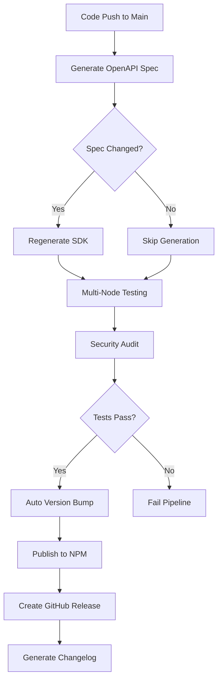

# CI/CD Workflow Documentation

## TypeScript SDK Automated Publishing Pipeline

The EvalMatch TypeScript SDK uses a comprehensive CI/CD pipeline that automatically generates, tests, and publishes the SDK when API changes are detected.

## Workflow Overview



## Pipeline Stages

### 1. Generate Stage

**Triggers**: Changes to API documentation or SDK source
**Duration**: ~2-3 minutes

- Checks out repository code
- Installs Node.js dependencies
- Generates OpenAPI specification from Swagger config
- Compares with existing spec to detect changes
- Regenerates TypeScript SDK if API changed
- Uploads artifacts for downstream stages

**Outputs**:
- OpenAPI specification (`docs/api/openapi.yaml`)
- Generated SDK code (`sdks/typescript/src/generated/`)
- Change detection flag for conditional publishing

### 2. Test Stage

**Triggers**: All pushes and pull requests
**Duration**: ~5-7 minutes per Node.js version

Runs in parallel across Node.js versions (18, 20, 22):
- Downloads generated SDK artifacts if spec changed
- Installs SDK dependencies
- Runs TypeScript type checking
- Executes ESLint code quality checks
- Builds SDK distribution bundles
- Tests SDK functionality with mock data
- Reports bundle sizes and metrics

**Quality Gates**:
- TypeScript compilation must succeed
- All linting rules must pass
- SDK test functionality must work
- Bundle size within acceptable limits

### 3. Publish Stage

**Triggers**: Main branch pushes with API changes OR manual force publish
**Duration**: ~3-4 minutes

**Prerequisites**:
- All tests must pass
- Security audit must be clean
- Runs only in `npm-publishing` environment

**Process**:
- Downloads tested build artifacts
- Determines versioning strategy (auto-patch, tagged, or manual)
- Updates package metadata with repository links
- Generates changelog entry
- Performs dry-run publish validation
- Publishes to NPM registry
- Creates Git tag for auto-versioned releases
- Creates GitHub release with detailed notes

### 4. Security Stage

**Triggers**: All builds (runs in parallel with tests)
**Duration**: ~2-3 minutes

- Downloads generated SDK if spec changed
- Runs NPM security audit (moderate level)
- Checks for outdated dependencies
- Validates package.json structure
- Reports security vulnerabilities

## Versioning Strategy

### Automatic Patch Versioning

When OpenAPI specification changes are detected:
```bash
# Current version: 1.0.5
# After API change: 1.0.6 (auto-incremented)
```

### Tagged Releases

For specific version releases:
```bash
git tag sdk-v1.1.0
git push origin sdk-v1.1.0
# Publishes as version 1.1.0
```

### Manual Publishing

Use existing version without changes:
- Workflow dispatch with "Force publish" option
- Useful for republishing after failed deploys
- Uses current package.json version

## Environment Configuration

### Required Secrets

| Secret | Purpose | Format |
|--------|---------|---------|
| `NPM_TOKEN` | NPM publishing authentication | `npm_...` |
| `GITHUB_TOKEN` | GitHub release creation | Auto-provided |

### Environment Variables

| Variable | Value | Purpose |
|----------|-------|---------|
| `NODE_VERSION` | `20` | Primary Node.js version |
| `SDK_DIR` | `sdks/typescript` | SDK working directory |

## Conditional Logic

### When SDK Regeneration Occurs

- OpenAPI spec file changes
- Swagger configuration changes
- Manual force regeneration

### When Publishing Happens

- Main branch push AND (spec changed OR force publish)
- Tagged release push (`sdk-v*`)

### When Tests Run

- All pushes to any branch
- All pull requests
- Manual workflow dispatch

## Artifacts & Caching

### Generated Artifacts

- **OpenAPI Spec**: Retained for 7 days
- **Generated SDK**: Retained for 1 day (regenerated frequently)
- **Built Distribution**: Retained for 30 days

### Caching Strategy

- NPM dependencies cached by Node.js version
- Reduces build time from 5+ minutes to ~2 minutes
- Cache invalidated when package-lock.json changes

## Error Handling

### Build Failures

**TypeScript Errors**:
- Pipeline fails immediately
- Detailed error logs in Actions tab
- No publication occurs

**Test Failures**:
- Continues with other Node.js versions
- Must pass on all versions to proceed
- ESLint failures are non-blocking (continue-on-error)

**Security Issues**:
- Moderate+ vulnerabilities fail the build
- Outdated dependencies logged but don't fail
- Manual intervention required for fixes

### Publication Failures

**NPM Registry Issues**:
- Automatic retry on temporary failures
- Dry-run validation prevents most issues
- Manual republish available via workflow dispatch

**Version Conflicts**:
- NPM prevents duplicate version publishing
- Pipeline fails with clear error message
- Requires manual version bump or tag

## Monitoring & Notifications

### Success Indicators

- ✅ Green checkmarks in GitHub Actions
- 📦 New package version on NPM
- 🏷️ New Git tag for auto-versioned releases
- 📝 GitHub release with changelog

### Failure Notifications

- ❌ Failed status checks on pull requests
- 📧 Email notifications to committers
- 🔔 GitHub notifications to repository watchers

## Manual Interventions

### Emergency Hotfix

```bash
# 1. Fix critical issue
git commit -m "fix: critical security patch"

# 2. Create emergency tag
git tag sdk-v1.0.7-hotfix
git push origin sdk-v1.0.7-hotfix

# 3. Monitor Actions tab for deployment
```

### Rollback Procedure

```bash
# 1. Identify last good version
npm view @evalmatch/sdk versions --json

# 2. Add deprecation notice to bad version
npm deprecate @evalmatch/sdk@1.0.6 "Security issue, use 1.0.7+"

# 3. Users automatically get warnings
```

### Debug Failed Build

1. **Check Actions logs**: Detailed error messages and stack traces
2. **Reproduce locally**: Use same Node.js version and commands
3. **Verify dependencies**: Check for version conflicts
4. **Test incremental**: Run each build step individually

## Performance Metrics

### Typical Build Times

- **Fast path** (no spec changes): ~3-4 minutes
- **Full rebuild** (spec changes): ~8-10 minutes
- **Parallel testing**: ~5-7 minutes per Node version
- **Publishing**: ~3-4 minutes

### Bundle Size Tracking

Current SDK bundle sizes:
- **ESM**: ~22KB minified
- **CommonJS**: ~24KB minified
- **TypeScript definitions**: ~29KB
- **Total package**: ~75KB

## Best Practices

### For Developers

1. **Test locally** before pushing
2. **Use semantic commit messages** for better changelogs
3. **Review Actions output** after significant changes
4. **Monitor NPM download stats** for adoption tracking

### For API Changes

1. **Update OpenAPI spec** in swagger-config.ts
2. **Test generated SDK** with new endpoints
3. **Update documentation** for breaking changes
4. **Consider major version bump** for breaking changes

### For Releases

1. **Use descriptive Git tags** for manual releases
2. **Include release notes** in tag messages
3. **Coordinate with team** for major version releases
4. **Test published package** before announcing